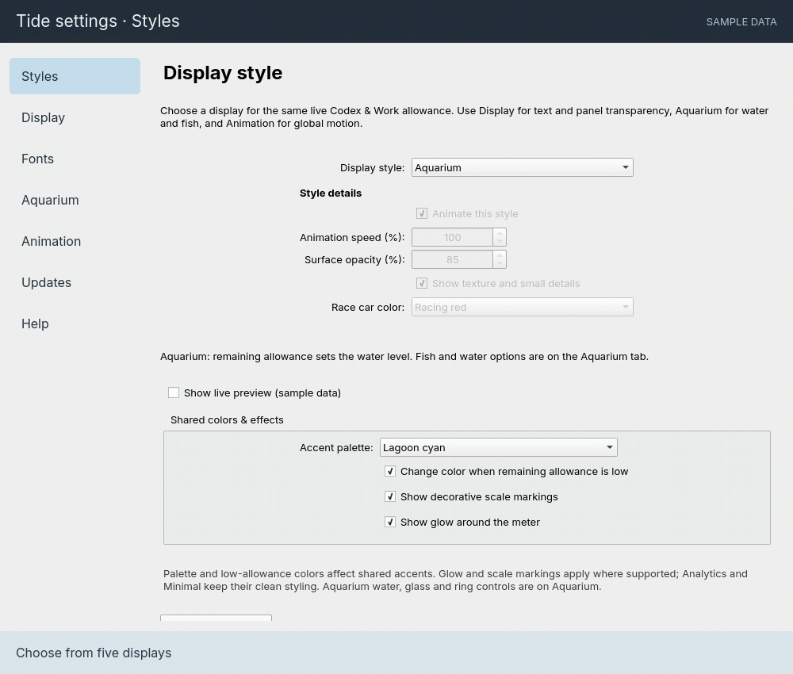
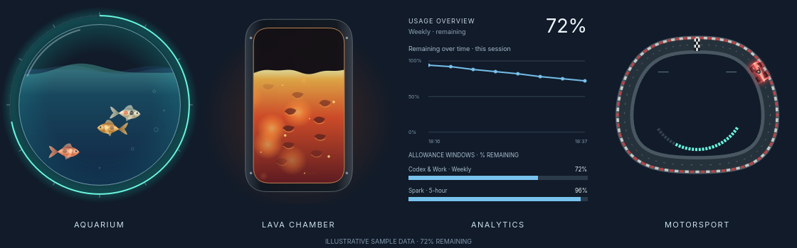
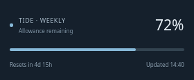

# Tide — Codex & Work Usage for KDE

**Version 1.8.2 · KDE Plasma 6 · MIT license**

Keep your remaining allowance on your desktop, in a style that fits your setup. Tide offers five displays, transparent surfaces, system or custom fonts, and a searchable settings guide. Every display can show token totals and usage rates from your local Codex logs; Analytics adds a detailed breakdown and graph.

**[Download the widget](tide-usage.plasmoid?raw=true)** · [Watch the 40-second configuration showcase](social/tide-widget-configurations.mp4) · [Settings help](HELP.md)

## What’s new in 1.8.2

- Local token totals and rates on all five displays, with a full breakdown and graph in Analytics.
- Organized settings: aquarium-specific controls under Aquarium, shared effects under Styles, and a dedicated Animation page.
- Working live style preview, adjustable sample allowance, and a single built-in About section.
- Refreshed video and settings tour, plus versioned installable release packages.

## Video preview

https://github.com/user-attachments/assets/9f5c7fd4-78fc-4821-8c25-1eb3a32a7198

Forty seconds of the current widget, two configurations per display, with sample data and no title or ending screen. [Download the MP4](social/tide-widget-configurations.mp4).

## Settings tour



The tour uses the real settings components in a presentation frame with sample data.

## Display gallery



*Four of the five displays, rendered from the widget with sample data. Minimal is shown below.*



## What Tide measures

| Data | What you see | Scope |
| --- | --- | --- |
| Shared allowance | Percentage remaining, quota windows and reset times | Reported Codex & Work account limits, including Workspace Agents and ChatGPT for Excel |
| Local tokens | Today’s total, input, cached input, output and reasoning counts | Codex logs stored in this computer’s local profile, across recorded accounts and models |
| Local token rate | Trailing five-minute average and a one-hour bar chart | Recorded token events, grouped into five-minute bins |

**Ordinary ChatGPT conversations are not included.** Local token counts are not account-wide billing totals and cannot be converted into allowance percentages. Cached tokens are already included in input; reasoning tokens are already included in output.

## Requirements

- Linux running **KDE Plasma 6**. Plasma 5 is not supported.
- **Kirigami** and **Plasma5Support**, including its executable data engine.
- **Python 3**.
- A **Codex CLI installation signed in to your own account**, with allowance information available.
- Internet access for account-limit refreshes. Local token scans use files already on disk.

Tide looks for `codex` on the desktop session’s `PATH`, then falls back to `/usr/lib/chatgpt/resources/codex`. No separate API key is required by the widget.

Tested on **CachyOS with KDE**. Other Plasma 6 distributions are intended to work with these dependencies, but have not yet been verified. Dependency package names and Codex installation paths vary by distribution. PySide6 and FFmpeg are development/preview tools, not runtime requirements.

## Install

### From the widget package

1. Download [`tide-usage.plasmoid`](tide-usage.plasmoid?raw=true).
2. Open KDE’s **Add Widgets → Get New Widgets → Install Widget From Local File** and select it.
3. Search for **Tide** in Add Widgets and place it on your desktop.

### From the source repository

Choose **Code → Download ZIP**, extract it, and run this inside the extracted folder:

```bash
bash install.sh
```

The installer copies the widget to `${XDG_DATA_HOME:-$HOME/.local/share}/plasma/plasmoids/local.tide.usage`. It does not install a background service or restart Plasma.

### Updating an existing installation

Install the newer package or run the installer again. If the old version remains visible, press **Alt+Space** and run:

```bash
plasmashell --replace
```

Your desktop and panels briefly reload; application windows remain open. This clears the in-memory allowance trend. Ordinary settings changes only need **Apply** or **OK**.

## Choose your display

Right-click Tide → **Configure Tide / Tide Settings → Styles**.

| Display | Appearance | Suggested size |
| --- | --- | --- |
| Aquarium | Translucent water, detailed swimming fish, bubbles and a quota ring | 360 × 610 with tokens; 360 × 500 without |
| Lava chamber | Molten fill, drifting crust, heat pockets and embers | 360 × 610 with tokens; 360 × 500 without |
| Motorsport | An open-wheel car on a circuit, with an inner allowance gauge | 360 × 610 with tokens; 360 × 500 without |
| Analytics | Allowance history, quota bars, local token totals and rates | 360 × 810 with tokens; 360 × 540 without |
| Minimal | Percentage, slim quota bar, reset and update times | 280 × 220 with tokens; 280 × 116 without |

Aquarium and Lava fill levels represent remaining allowance. Motorsport’s inner gauge represents allowance; the car’s lap position is decorative. Minimal omits secondary bars, credits and action buttons to stay compact; hover for status and error details.

**Meter-only mode** hides text and controls. Minimum sizes are 120 × 120 for decorative meters, 280 × 240 for Analytics, and 140 × 20 for Minimal. Larger fonts require more room. Plasma may preserve the old size when switching styles; resize the desktop widget as needed.

## Customize it

- **Display:** meter-only mode, individual text visibility, and text scaling from 70–160%.
- **Fonts:** follow KDE’s system font or choose a custom family, style and base size.
- **Aquarium:** fish count, size, speed and colors; independent fish/water animation, bubbles and waves.
- **Aquarium appearance:** water transparency, glass shading, the aquarium ring and glow intensity are grouped on Aquarium. Shared colors, glow and markings are on Styles; panel opacity is on Display.
- **Styles:** motion, speed, surface opacity and detail for Lava and Motorsport, plus car colors.
- **Updates:** refresh every 1–30 minutes (default three), main allowance selection and local token analytics toggle.

The dedicated **Animation** page contains the master motion switch and frame pacing for decorative displays: **Balanced** (up to 30 fps, default), **Smooth** (up to 60 fps), **Match display**, or **Custom** (10–240 fps). Actual cadence depends on Qt, the compositor and system load. Motion speed remains time-based; a higher frame cap does not speed up the animation. Analytics and Minimal do not need continuous decorative animation.

Settings are organized into labeled groups. Display visibility uses two columns when space allows, and style previews can be expanded on demand. The preview uses the actual widget and follows current Styles edits; apply changes on other pages and return to Styles to see them. Sample allowance can be adjusted to inspect warning colors. Meter-only mode disables overridden text controls while preserving their values. Settings are saved per widget instance. Controls affect only displays that use those features. The **Help** tab explains all 49 settings, defaults, ranges and troubleshooting, works offline, and supports search and section filters. Read the same guide in [HELP.md](HELP.md).

## Analytics: two kinds of history

### Allowance history

Tide keeps up to 480 successful snapshots in memory while the widget runs. The graph starts with individual points and connects them after eight readings—about 21 minutes after the first reading at the default interval. Long gaps remain unconnected, and quota resets start a separate series. Reloading the widget clears this history; earlier account activity is not downloaded.

### Local token history

Local token usage is available on every display. Enable **Updates → Show local token usage on all displays** for today’s local token total and the last five-minute average rate. Analytics also shows the full breakdown and hourly graph. The readout follows the configured refresh interval and is hidden in meter-only mode. It measures this local Codex profile across accounts, not account-wide billing usage.

Enabled by default under **Updates → Show local token usage on all displays**. Tide reads token-counter metadata from `sessions/` and `archived_sessions/` under `CODEX_HOME` (default `~/.codex`).

“Today” starts at local midnight. The tokens/minute figure is the recorded total during the trailing five minutes divided by five, not instantaneous generation speed. Twelve five-minute bars cover the last hour, with a zero baseline and an automatically scaled maximum. Values refresh at the configured usage interval.

Repeated cumulative reports and copied records with matching timestamps/counters are deduplicated. Missing initial history, malformed records or scan limits produce a **PARTIAL** label. File reading is bounded to 256 MiB and a five-second budget. Deleted, missing or remote session logs can make local totals incomplete, and Codex’s log format may change.

Turning the option off hides the section and stops subsequent scans. Meter-only mode hides token details. Local token results can still update when the account-limit read fails.

## Privacy and troubleshooting

Tide uses your existing Codex sign-in and the local `codex app-server --stdio` interface to read `account/rateLimits/read`. It does not create model turns, purchase credits or redeem resets. Codex may maintain its own state and refresh authentication during a read.

The package includes no credentials or account data. Local token results contain counters, not conversation text or session paths. Tide does not save new usage-history files.

| Symptom | What to check |
| --- | --- |
| OFFLINE or an update error | Confirm Codex is installed, signed in and reachable from the desktop session; then refresh. |
| STALE | The previous successful allowance reading is retained after a failure or overdue update. Inspect the error text or hover tooltip. |
| Empty allowance graph | Allow successful readings to accumulate; a newly opened widget has no prior allowance history. |
| No local token records | Check whether this Codex profile has session logs containing token counters. Remote activity may not be recorded here. |
| PARTIAL token results | Some records or initial history could not be fully processed. Treat the displayed totals as incomplete. |
| Text blends into wallpaper | Increase **Display → Background panel opacity**. |
| Old widget after an update | Reload Plasma with `plasmashell --replace`. |

## Development

Every published update includes a new version, release and packages. See [RELEASING.md](RELEASING.md). Run `python3 release.py` to build the versioned installer, portable source ZIP and SHA-256 checksums.

Build the installable package without connecting an account:

```bash
python3 build.py
```

Run the tests:

```bash
python3 tests/test_usage.py
python3 tests/test_local_tokens.py
python3 tests/test_frame_clock.py
python3 tests/test_qml.py
```

The Qt-based tests require PySide6 and KDE QML modules. The 24 tests cover allowance parsing, token deduplication, resets, midnight boundaries, rate calculations, partial scans, frame pacing, settings bindings and widget rendering. QML linting:

```bash
qmllint package/contents/ui/*.qml package/contents/config/config.qml
```

## Preview and sharing files

- [40-second configuration video](social/tide-widget-configurations.mp4): all five displays, two configurations each, without title or ending screens; vertical 1080p at 60 fps.
- [Cover image](social/tide-cover.png) and [suggested caption](social/caption.txt).
- [Sharing folder](social/), including the original longer video.

Previews use actual QML renderers and illustrative data, not live account readings. They demonstrate appearance, not hardware performance. The updated configuration video includes local token analytics on every display. A separate [settings GIF](social/tide-settings-tour.gif) tours the current controls and live preview. The older introductory video is retained for reference.

## Remove

Remove Tide from the desktop, then delete only the `local.tide.usage` folder under your user data directory’s `plasma/plasmoids/` folder.

## Author and license

Created by **Nicholas Hillsdale**. Distributed under the [MIT License](LICENSE). Tide is an independent community project.

References: [Codex app-server documentation](https://learn.chatgpt.com/docs/app-server), [KDE widget configuration](https://develop.kde.org/docs/plasma/widget/configuration/), [KDE widget testing](https://develop.kde.org/docs/plasma/widget/testing/).
